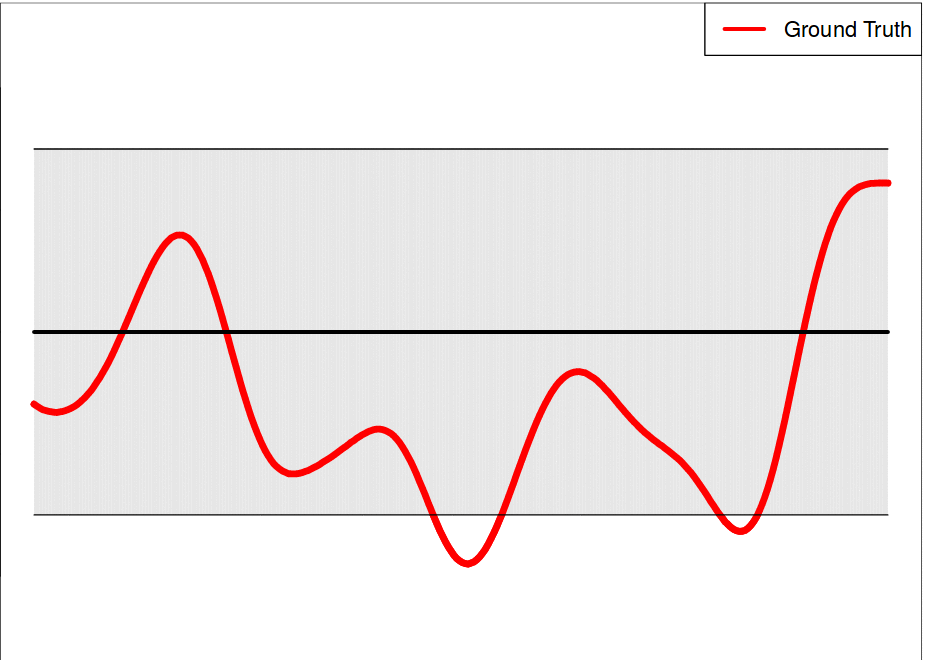

Parallel Asynchronous Remote Optimization
==========================================

.. image:: https://readthedocs.org/projects/paryopt/badge/?version=latest
   :target: https://paryopt.readthedocs.io/en/latest/?badge=latest
   :alt: Documentation Status

.. image:: https://baskar-group.me.iastate.edu/jenkins/buildStatus/icon?job=PARyOpt
   :target: https://baskar-group.me.iastate.edu/jenkins/job/PARyOpt
   :alt: Build Status

.. image:: https://img.shields.io/badge/License-MIT-yellow.svg
   :target: https://opensource.org/licenses/MIT
   :alt: License

This framework performs Asynchronous Bayesian Optimization with support for remote evaluations, resilient to hardware/software failures

Documentation for the software is available on ReadTheDocs_.

How do I get set up?
--------------------

This code is compatible with Python3.5, and requires several modules. The requirements are available in `requirements.txt`. If you are doing a tar ball installation, do

.. code-block:: bash

   python3.5 -m pip install -r requirements.txt
   python3.5 -m pip install setup.py

If you are using a pip installation, simply do

.. code-block:: bash

   python3.5 -m pip install paryopt

Citing:
-------

The publication related to the implementation can be found on arxiv_. If you use PARyOpt, please cite as:

   Pokuri, B. S. S., Lofquist, A., Risko, C. M., & Ganapathysubramanian, B. (2018). 
   PARyOpt: A software for Parallel Asynchronous Remote Bayesian Optimization. 
   arXiv preprint arXiv:1809.04668.

Bibtex entry ::

   @article{pokuri2018paryopt,   
   title={PARyOpt: A software for Parallel Asynchronous Remote Bayesian Optimization},
   author={Pokuri, Balaji Sesha Sarath and Lofquist, Alec and Risko, Chad M and Ganapathysubramanian, Baskar},
   journal={arXiv preprint arXiv:1809.04668},
   year={2018}
   }

Who do I talk to?
-----------------

`Balaji Pokuri`_

`Alec Lofquist`_

`Baskar Ganapathysubramanian`_

.. _`Balaji Pokuri`: mailto:balajip@iastate.edu
.. _`Alec Lofquist`: mailto:lofquist@iastate.edu
.. _`Baskar Ganapathysubramanian`: mailto:baskarg@iastate.edu
.. _arxiv: https://arxiv.org/pdf/1809.04668
.. _ReadTheDocs: http://paryopt.readthedocs.io
